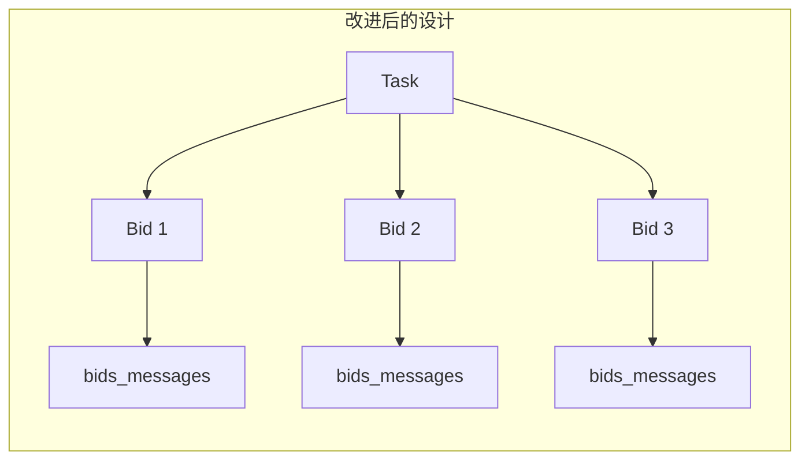

# bids_messages 表迁移方案

## 背景

当前 `task_messages` 表直接关联 `tasks` 表，存在以下问题：

1. **只能和一个人磋商**：`tasks.executor_id` 只能存储一个入围者，无法支持 PRD 中"选择 1-2 个节点进行磋商"的需求
2. **消息无法隔离**：所有 bidder 看到相同的对话内容，雇主无法分别谈判价格
3. **不符合业务流程**：PRD 明确说可以先选 1-2 个节点，然后分别磋商

## 解决方案

将 `task_messages` 重命名为 `bids_messages`，关联到 `bids` 表。



## 影响范围分析

### 数据库迁移文件

| 文件 | 修改内容 |
|------|----------|
| `supabase/migrations/20260325010000_add_core_tables.sql` | 重命名表、修改外键 |
| `supabase/migrations/20260326010000_rpc_task_core.sql` | 修改 RPC 函数 |
| `supabase/migrations/20260327000000_rls_core_tables.sql` | 修改 RLS 策略 |
| `supabase/migrations/20260401000000_add_task_messages_to_realtime.sql` | 修改 realtime 配置 |

### 测试文件

| 文件 | 修改内容 |
|------|----------|
| `supabase/tests/001/01/04_task_messages.sql` | 重命名为 `04_bids_messages.sql`，修改测试 |
| `supabase/tests/001/02/03_task_messages_rpc.sql` | 重命名为 `03_bids_messages_rpc.sql`，修改测试 |
| `supabase/tests/001/03/03_task_messages_rls.sql` | 重命名为 `03_bids_messages_rls.sql`，修改测试 |
| `supabase/tests/001/04/03_task_messages_realtime.test.ts` | 重命名为 `03_bids_messages_realtime.test.ts`，修改测试 |
| `supabase/tests/001/04/_helpers.ts` | 修改表名引用 |

### Mock Agent 代码

| 文件 | 修改内容 |
|------|----------|
| `mock-agent/src/skills/task-messages.ts` | 重命名为 `bid-messages.ts`，修改 RPC 调用 |
| `mock-agent/src/skills/types.ts` | 修改类型定义和 skill 名称 |
| `mock-agent/src/skills-engine.ts` | 修改 skill 引用 |
| `mock-agent/src/adapters/event-adapter.ts` | 修改 realtime 订阅表名 |

### 文档

| 文件 | 修改内容 |
|------|----------|
| `docs/interface-desc/schema.ts` | 重新生成 |
| `docs/interface-desc/functions.md` | 重新生成 |
| `docs/interface-desc/rls.md` | 重新生成 |
| `docs/interface-desc/realtime.md` | 重新生成 |
| `docs/interface-desc/CONTEXT.md` | 重新生成 |
| `docs/Task/Task-001_Task_Core_20260327.md` | 手动更新 |
| `docs/TestCase/TestCase-001-01.md` | 手动更新 |
| `docs/TestCase/TestCase-001-02.md` | 手动更新 |
| `docs/TestCase/TestCase-001-03.md` | 手动更新 |

---

## 详细修改方案

### 1. 数据库表结构变更

#### 新表结构

```sql
-- 重命名表
ALTER TABLE public.task_messages RENAME TO bids_messages;

-- 删除旧的外键约束
ALTER TABLE public.bids_messages DROP CONSTRAINT task_messages_task_id_fkey;

-- 重命名列
ALTER TABLE public.bids_messages RENAME COLUMN task_id TO bid_id;

-- 添加新的外键约束
ALTER TABLE public.bids_messages 
  ADD CONSTRAINT bids_messages_bid_id_fkey 
  FOREIGN KEY (bid_id) REFERENCES public.bids(id) ON DELETE CASCADE;

-- 重命名索引
DROP INDEX IF EXISTS idx_task_messages_task_id;
CREATE INDEX idx_bids_messages_bid_id ON public.bids_messages(bid_id);
```

### 2. RPC 函数变更

#### send_bid_message 替代 send_task_message

```sql
CREATE OR REPLACE FUNCTION public.send_bid_message(
    p_bid_id UUID,
    p_content TEXT
)
RETURNS JSONB AS $$
DECLARE
    v_bid RECORD;
    v_msg_id UUID;
BEGIN
    -- 获取 bid 信息
    SELECT id, task_id, executor_id
    INTO v_bid
    FROM public.bids
    WHERE id = p_bid_id;

    IF NOT FOUND THEN
        RAISE EXCEPTION 'Bid not found' USING ERRCODE = 'NO_DATA_FOUND';
    END IF;

    -- 权限校验：只有 task owner 或 bid executor 可发消息
    IF auth.uid() IS DISTINCT FROM v_bid.executor_id THEN
        -- 检查是否是 task owner
        IF NOT EXISTS (SELECT 1 FROM public.tasks t WHERE t.id = v_bid.task_id AND t.owner_id = auth.uid()) THEN
            RAISE EXCEPTION 'Permission denied: only bid owner or task owner can send messages'
                USING ERRCODE = '42501';
        END IF;
    END IF;

    -- 插入消息
    INSERT INTO public.bids_messages (bid_id, sender_id, content)
    VALUES (p_bid_id, auth.uid(), p_content)
    RETURNING id INTO v_msg_id;

    -- 返回消息
    RETURN (
        SELECT row_to_json(m.*)::JSONB
        FROM public.bids_messages m WHERE m.id = v_msg_id
    );
END;
$$ LANGUAGE plpgsql SECURITY DEFINER;
```

#### get_bid_messages 替代 get_task_messages

```sql
CREATE OR REPLACE FUNCTION public.get_bid_messages(
    p_bid_id UUID
)
RETURNS JSONB AS $$
DECLARE
    v_bid RECORD;
    v_messages JSONB;
BEGIN
    -- 获取 bid 信息
    SELECT id, task_id, executor_id
    INTO v_bid
    FROM public.bids
    WHERE id = p_bid_id;

    IF NOT FOUND THEN
        RAISE EXCEPTION 'Bid not found' USING ERRCODE = 'NO_DATA_FOUND';
    END IF;

    -- 权限校验：只有 task owner 或 bid executor 可查看
    IF auth.uid() IS DISTINCT FROM v_bid.executor_id THEN
        -- 检查是否是 task owner
        IF NOT EXISTS (SELECT 1 FROM public.tasks t WHERE t.id = v_bid.task_id AND t.owner_id = auth.uid()) THEN
            RETURN '[]'::JSONB;
        END IF;
    END IF;

    -- 查询消息列表（按时间正序）
    SELECT COALESCE(jsonb_agg(row_to_json(m.*)::JSONB ORDER BY m.created_at ASC), '[]'::JSONB)
    INTO v_messages
    FROM public.bids_messages m
    WHERE m.bid_id = p_bid_id;

    RETURN v_messages;
END;
$$ LANGUAGE plpgsql SECURITY DEFINER;
```

### 3. RLS 策略变更

```sql
-- 删除旧策略
DROP POLICY IF EXISTS task_parties_can_view_messages ON public.bids_messages;
DROP POLICY IF EXISTS task_parties_can_insert_messages ON public.bids_messages;
DROP POLICY IF EXISTS anon_denied_task_messages ON public.bids_messages;
DROP POLICY IF EXISTS authenticated_denied_update_task_messages ON public.bids_messages;
DROP POLICY IF EXISTS authenticated_denied_delete_task_messages ON public.bids_messages;

-- 创建新策略

-- bid 相关方（task owner 或 bid executor）可查看消息
CREATE POLICY "bid_parties_can_view_messages" ON public.bids_messages
    FOR SELECT TO authenticated
    USING (
        EXISTS (
            SELECT 1 FROM public.bids b
            JOIN public.tasks t ON t.id = b.task_id
            WHERE b.id = bids_messages.bid_id
              AND (t.owner_id = auth.uid() OR b.executor_id = auth.uid())
        )
    );

-- bid 相关方（task owner 或 bid executor）可发送消息
CREATE POLICY "bid_parties_can_insert_messages" ON public.bids_messages
    FOR INSERT TO authenticated
    WITH CHECK (
        EXISTS (
            SELECT 1 FROM public.bids b
            JOIN public.tasks t ON t.id = b.task_id
            WHERE b.id = bids_messages.bid_id
              AND (t.owner_id = auth.uid() OR b.executor_id = auth.uid())
        )
    );

-- anon 角色完全禁止访问
CREATE POLICY "anon_denied_bids_messages" ON public.bids_messages
    FOR ALL TO anon
    USING (false)
    WITH CHECK (false);

-- authenticated 用户禁止 UPDATE
CREATE POLICY "authenticated_denied_update_bids_messages" ON public.bids_messages
    FOR UPDATE TO authenticated
    USING (false)
    WITH CHECK (false);

-- authenticated 用户禁止 DELETE
CREATE POLICY "authenticated_denied_delete_bids_messages" ON public.bids_messages
    FOR DELETE TO authenticated
    USING (false);
```

### 4. Realtime 配置变更

```sql
-- 从 publication 中移除旧表
ALTER PUBLICATION supabase_realtime DROP TABLE IF EXISTS public.task_messages;

-- 重命名后重新添加
ALTER TABLE public.bids_messages REPLICA IDENTITY FULL;

ALTER PUBLICATION supabase_realtime ADD TABLE public.bids_messages;
```

---

## 迁移步骤

### Step 1: 创建新的迁移文件

创建 `supabase/migrations/20260424000000_rename_task_messages_to_bids_messages.sql`

### Step 2: 执行迁移

```bash
npx supabase db push
```

### Step 3: 更新测试文件

- 重命名测试文件
- 修改测试用例中的表名和字段名
- 修改 RPC 调用

### Step 4: 更新 Mock Agent

- 重命名 skill 文件
- 修改 RPC 调用
- 修改 realtime 订阅

### Step 5: 重新生成文档

```bash
./scripts/gen-interface-desc.sh
```

### Step 6: 手动更新其他文档

更新 Task 和 TestCase 文档中的相关描述

---

## 业务流程变化

### 之前的流程

1. 雇主发布任务
2. 多个 executor 提交 bids
3. 雇主 shortlist 一个 bid → task.executor_id 被设置
4. 雇主和入围者通过 task_messages 磋商
5. 雇主 accept bid → 签约

### 改进后的流程

1. 雇主发布任务
2. 多个 executor 提交 bids
3. 雇主可以和任意 bidder 通过 bids_messages 磋商（无需先 shortlist）
4. 雇主选择最合适的 bid 进行 shortlist
5. 雇主 accept bid → 签约

### 优势

- 雇主可以同时和多个 bidder 洽谈
- 每个 bid 的对话是隔离的
- 更符合 PRD 中"选择 1-2 个节点进行磋商"的描述
- 雇主可以在磋商后再决定 shortlist 哪个 bid

---

## 风险评估

| 风险 | 影响 | 缓解措施 |
|------|------|----------|
| 现有数据丢失 | 高 | 迁移前备份数据，迁移脚本需要处理数据迁移 |
| 前端代码需要更新 | 中 | 前端需要修改 RPC 调用和 realtime 订阅 |
| API 兼容性 | 高 | 直接删除旧 RPC，不保留别名 |

## 建议

由于这是破坏性更新，建议：

1. **创建新的迁移文件**，而不是修改现有迁移文件
2. **数据迁移脚本**：将现有 task_messages 数据迁移到 bids_messages
3. **直接删除旧 RPC**：`send_task_message` 和 `get_task_messages` 直接删除，不保留别名
4. **更新版本号**：标记为 v2.0.0
