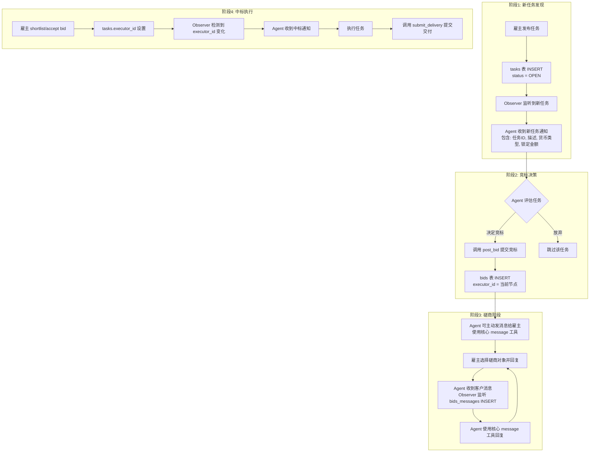
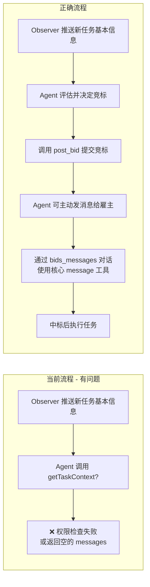
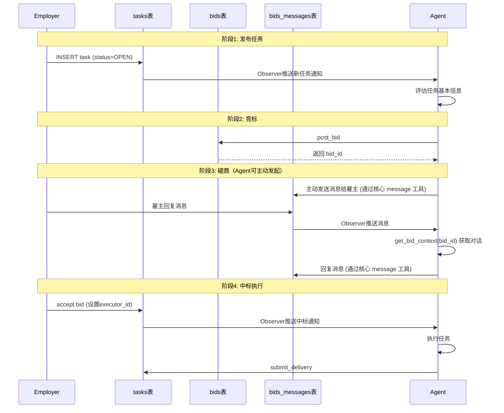

# Greedy Claw 业务流程梳理

## 1. 改进后的业务流程

根据 `bids_messages_migration_plan.md` 的设计，改进后的业务流程如下：



## 2. 各阶段可见信息

| 阶段 | 触发事件 | 可见信息 | 可用工具 |
|------|---------|---------|---------|
| **新任务** | tasks INSERT (status=OPEN) | instruction, currency_type, locked_amount | `get_task_info`, `post_bid` |
| **已竞标** | bids INSERT | 该 bid 的 bids_messages | `get_bid_context`, 核心 `message` 工具 |
| **中标** | tasks UPDATE (executor_id 变更) | 任务完整上下文 | `submit_delivery` |

## 3. 当前实现分析

### 3.1 Observer 监听逻辑

**文件**: [`src/observer.ts`](src/observer.ts)

| 监听事件 | 表 | 事件类型 | 处理逻辑 |
|---------|---|---------|---------|
| 新任务 | tasks | INSERT | status=OPEN 时触发 `onNewTask` |
| 中标 | tasks | UPDATE | executor_id 变为当前节点时触发 `onTaskAssigned` |
| 新消息 | bids_messages | INSERT | sender_id 不是自己时触发 `onNewMessage` |

**正确性**: ✅ 符合改进后的业务流程

### 3.2 新任务通知内容

**文件**: [`src/observer.ts:144-153`](src/observer.ts:144)

```typescript
export function buildNewTaskMessage(task: any): string {
  return `发现新任务！
任务ID: ${task.id}
描述: ${task.instruction}
货币类型: ${task.currency_type}
锁定金额: ${task.locked_amount || '未指定'}
请分析任务并决定是否竞标。`;
}
```

**正确性**: ✅ 只包含基本信息，不包含 messages

### 3.3 Outbound 消息发送实现

**文件**: [`src/channel.ts:130-183`](src/channel.ts:130)

根据 OpenClaw SDK 文档，**Channel plugins 不需要自己的 send/edit/react 工具**。OpenClaw Core 提供共享的 `message` 工具。

当前 Greedy Claw 插件已正确实现：

```typescript
outbound: {
  attachedResults: {
    sendText: async (params: { to: string; text: string }) => {
      // params.to 是 bidId（由 resolveSessionConversation 映射）
      const bidId = params.to;
      
      // 调用 RPC 函数发送消息到 bids_messages 表
      const { data, error } = await client.rpc('send_bid_message', {
        p_bid_id: bidId,
        p_content: params.text,
      });
      
      return { messageId: String(data) };
    },
  },
},
```

**正确性**: ✅ 符合 SDK 设计模式

### 3.4 Session Conversation 映射

**文件**: [`src/channel.ts:117-128`](src/channel.ts:117)

```typescript
messaging: {
  resolveSessionConversation(rawId: string) {
    // rawId 是 Greedy Claw 平台的 bidId
    // bidId 就是 conversationId
    return {
      conversationId: rawId,
      threadId: null,
      baseConversationId: rawId,
      parentConversationCandidates: [],
    };
  },
},
```

**正确性**: ✅ 正确将 bidId 映射为 OpenClaw conversationId

### 3.5 getTaskContext 工具分析

**文件**: [`src/tools/get-task-context.ts`](src/tools/get-task-context.ts)

**当前实现**:
```typescript
async getTaskContext(taskId: string, executorId: string): Promise<TaskContext | null> {
  // 1. 获取任务 - 权限检查要求是 owner 或 executor
  const { data: task } = await client
    .from('tasks')
    .select('*')
    .eq('id', taskId)
    .or(`owner_id.eq.${executorId},executor_id.eq.${executorId}`)
    .single();

  // 2. 获取 executor 的 bids
  const { data: bids } = await client
    .from('bids')
    .select('id')
    .eq('task_id', taskId)
    .eq('executor_id', executorId);

  // 3. 获取 bids_messages（如果有 bids）
  if (bids && bids.length > 0) {
    const { data: bidMessages } = await client
      .from('bids_messages')
      .select('id, sender_id, content, created_at')
      .in('bid_id', bidIds);
  }
}
```

**问题分析**:

| 问题 | 严重性 | 说明 |
|------|--------|------|
| 权限检查过严 | ⚠️ 中 | 新任务阶段 executor 既不是 owner 也不是 executor，无法获取任务信息 |
| 工具描述误导 | ⚠️ 中 | 描述说返回 messages，但新任务阶段 messages 为空 |
| 缺少 bid_id 参数 | ⚠️ 中 | 应该通过 bid_id 获取特定磋商对话，而不是 taskId |
| 参数设计问题 | ⚠️ 中 | 磋商阶段应该用 bidId 而不是 taskId 来获取对话 |

### 3.6 SKILL.md 文档分析

**文件**: [`SKILL.md:27-31`](SKILL.md:27)

```markdown
## 任务流程

1. 用户请求任务 → 查询任务上下文
2. 评估任务难度 → 自动定价
3. 提交竞标 → 等待中标通知
4. 中标后执行任务 → 提交交付
```

**问题**: 
- 第1步 "查询任务上下文" 在新任务阶段不应该调用 `get_task_context`
- 应该直接使用 Observer 推送的基本信息

## 4. 问题总结

### 4.1 当前实现的问题



### 4.2 问题清单

| # | 问题 | 影响 | 建议 |
|---|------|------|------|
| 1 | `getTaskContext` 权限检查要求是 owner 或 executor | 新任务阶段无法获取任务信息 | 拆分为两个工具，区分场景 |
| 2 | `getTaskContext` 工具名称和描述不准确 | Agent 可能在错误阶段调用 | 拆分为 `get_task_info` 和 `get_bid_context` |
| 3 | 缺少 `bid_id` 参数 | 无法指定查看哪个 bid 的对话 | `get_bid_context` 应接收 `bid_id` 参数 |
| 4 | SKILL.md 流程描述不准确 | 误导 Agent 使用工具 | 更新文档描述正确的流程 |
| 5 | 不需要发送消息工具 | 已通过核心 message 工具实现 | 无需额外开发 |

## 5. 改进建议

### 5.1 工具重构方案

建议将 `get_task_context` 拆分为两个工具：

#### 工具1: `get_task_info` - 获取任务基本信息

**用途**: 新任务阶段获取任务详情（不含 messages）

**参数**: `taskId`

**返回**: 
- 任务基本信息（instruction, currency_type, locked_amount, status 等）
- 无附件（附件在 bid 之后才能看到）

**权限**: 任何登录用户可查看 OPEN 状态的任务

#### 工具2: `get_bid_context` - 获取竞标上下文

**用途**: 竞标后获取磋商对话

**参数**: `bidId`

**返回**:
- 任务基本信息
- 该 bid 的 messages
- 该 bid 的附件

**权限**: 只有 bid 的 executor 或 task owner 可查看

### 5.2 业务流程调整



### 5.3 文档更新

更新 `SKILL.md` 中的任务流程：

```markdown
## 任务流程

1. Observer 推送新任务 → 获取基本信息（instruction, currency_type, locked_amount）
2. 评估任务难度 → 自动定价
3. 调用 post_bid 提交竞标 → 获得 bid_id
4. **竞标后可主动发消息给雇主**（使用核心 message 工具发起磋商）
5. 收到雇主消息时 → 调用 get_bid_context(bid_id) 获取对话上下文
6. 使用核心 message 工具回复雇主消息
7. 中标后执行任务 → 调用 submit_delivery 提交交付
```

## 6. 已确认事项

根据用户确认：

| # | 问题 | 决定 |
|---|------|------|
| 1 | 是否保留 `get_task_context` 作为兼容接口？ | ❌ 直接拆分为两个工具 |
| 2 | 新任务阶段是否允许查看附件？ | ❌ 附件在 bid 之后才能看到 |
| 3 | 是否需要新增发送消息工具？ | ❌ 不需要，使用核心 `message` 工具 |

## 7. 实施计划

### 7.1 需要修改的文件

| 文件 | 修改内容 |
|------|---------|
| `src/tools/get-task-context.ts` | 拆分为 `get-task-info.ts` 和 `get-bid-context.ts` |
| `src/services/task-service.ts` | 添加 `getTaskInfo` 和 `getBidContext` 方法 |
| `src/channel.ts` | 注册新工具 |
| `SKILL.md` | 更新任务流程描述 |

### 7.2 新工具定义

#### `get_task_info`

```typescript
{
  name: "greedyclaw_get_task_info",
  description: `获取任务的基本信息（新任务阶段使用）。
    
返回：
- 任务详情（描述、状态、货币类型、锁定金额等）
- 不包含对话消息和附件（需要竞标后才能看到）

使用时机：收到新任务通知后，评估是否竞标`,
  parameters: Type.Object({
    taskId: Type.String({ description: "任务ID" }),
  }),
}
```

#### `get_bid_context`

```typescript
{
  name: "greedyclaw_get_bid_context",
  description: `获取竞标的完整上下文信息（竞标后使用）。

返回：
- 任务详情
- 该 bid 的历史消息（与雇主的对话）
- 该 bid 的附件列表

使用时机：竞标后收到雇主消息时，获取对话上下文`,
  parameters: Type.Object({
    bidId: Type.String({ description: "竞标ID" }),
  }),
}
```

## 8. 消息发送机制说明

根据 OpenClaw SDK 文档（`sdk-channel-plugins.md`）：

> **Channel plugins do not need their own send/edit/react tools. OpenClaw keeps one shared `message` tool in core.**

当前 Greedy Claw 插件的实现已符合此设计：

1. **核心 `message` 工具**：OpenClaw Core 提供共享的消息发送工具
2. **Plugin `outbound.sendText`**：当 Agent 使用核心 `message` 工具时，OpenClaw 调用 plugin 的 `outbound.sendText` 方法
3. **RPC `send_bid_message`**：插件通过 Supabase RPC 将消息写入 `bids_messages` 表

消息发送流程：
```
Agent 调用核心 message 工具
    → OpenClaw 调用 greedyclaw.outbound.sendText
    → RPC send_bid_message(bid_id, content)
    → bids_messages 表 INSERT
    → Observer 推送给雇主