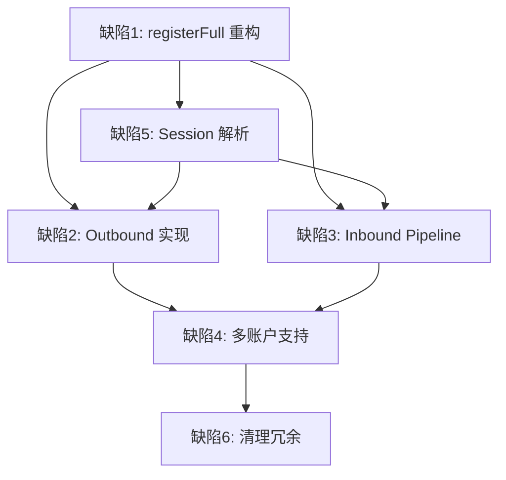

# Greedy Claw Plugin 修复计划

基于 `plans/Debug.md` 文档分析、[OpenClaw SDK 文档](https://docs.openclaw.ai/plugins/sdk-channel-plugins) 研究，以及 `BackendDoc/` 后端架构分析，以下是详细的修改计划。

---

## 问题总览

| # | 问题 | 严重程度 | 影响范围 |
|---|------|---------|---------|
| 1 | 生命周期断层 - `initializePlugin` 未被调用 | 🔴 致命 | 插件完全无法工作 |
| 2 | Outbound 反模式 - `sendText` 为空实现 + `ask-client` Tool | 🔴 致命 | Agent 消息被丢弃 |
| 3 | Inbound 非标准 - 直接调用 `subagent.run` | 🟠 严重 | 上下文历史断裂 |
| 4 | 多账户隔离缺失 - 单例注入 executorId | 🟠 严重 | 多账户场景污染 |
| 5 | 缺失 `messaging.resolveSessionConversation` | 🟠 严重 | 会话上下文断裂 |
| 6 | 冗余文件残留 | 🟡 中等 | 维护混乱 |

---

## 已确认的设计决策

### ✅ 决策 1：业务工具保留
`get-balance`、`post-bid`、`submit-delivery`、`get-task-context` 是 **GreedyClaw 业务功能工具**，不是消息工具。它们应该保留，让 AI 能够执行业务操作（查询余额、提交竞标、提交交付等）。

**与消息工具的区别**：
- 消息工具（`ask-client.ts`）→ 删除，使用 OpenClaw 核心共享的 `message` tool
- 业务工具（`get-balance` 等）→ 保留，通过 `api.registerTool` 注册

### ✅ 决策 2：继续使用 Supabase Realtime
**对比分析**：

| 特性 | Supabase Realtime | HTTP Webhook |
|------|-------------------|--------------|
| 连接方式 | WebSocket 长连接 | HTTP 请求-响应 |
| 触发模式 | 数据库变更时主动推送 | 需要 Edge Function 或外部中继 |
| 状态 | 有状态（需维护订阅） | 无状态 |
| 实时性 | 毫秒级 | 可能有延迟 |
| 基础设施 | Supabase 内置 | 需要 Edge Function 或外部服务 |

**选择 Realtime 的原因**：
1. [`observer.ts`](src/observer.ts:31) 已实现 Realtime 监听 `tasks`、`bids`、`task_messages` 表
2. 无需额外基础设施
3. 实时性更好，适合任务竞标场景

### ✅ 决策 3：账户上下文获取方案
使用 `createPluginRuntimeStore` + `setRuntime` 模式：

```typescript
import { createPluginRuntimeStore } from 'openclaw/plugin-sdk/runtime-store';

// 创建运行时存储
const runtimeStore = createPluginRuntimeStore();

export default defineChannelPluginEntry({
  setRuntime: (runtime) => runtimeStore.setRuntime(runtime),
  
  registerFull(api) {
    // 通过 store 访问配置
    const config = runtimeStore.getRuntime().config;       // 当前配置快照
    const pluginConfig = runtimeStore.getRuntime().pluginConfig; // 插件配置
  }
});
```

---

## 关键发现（来自 OpenClaw SDK 在线文档）

### 1. Channel plugins 不需要注册单独的 send/edit/react tools
> "Channel plugins do not need their own send/edit/react tools. OpenClaw keeps one shared `message` tool in core."

**影响**：`ask-client.ts` 是反模式，应该删除。Agent 发送消息通过核心的共享 `message` tool，最终调用 `outbound.attachedResults.sendText`。

### 2. registerFull 的正确用途
> "`registerFull` only runs when `api.registrationMode === 'full'`. It is skipped during setup-only loading."

**用途**：
- 注册 HTTP 路由（webhook 接收外部事件）
- 注册 Gateway RPC 方法（使用插件特定前缀）
- 注册后台服务（`api.registerService`）
- 注册业务 Tools（`get-balance`、`post-bid` 等）

### 3. Inbound 处理
> "Your plugin needs to receive messages from the platform and forward them to OpenClaw. The typical pattern is a webhook that verifies the request and dispatches it through your channel's inbound handler."

**推荐路径**：
- 使用 `openclaw/plugin-sdk/inbound-envelope` 构建 Envelope
- 通过 Channel 的 inbound pipeline dispatch 给核心

### 4. Session grammar
> "`messaging.resolveSessionConversation(...)` is the canonical hook for mapping `rawId` to the base conversation id, optional thread id, explicit `baseConversationId`, and any `parentConversationCandidates`."

**必须实现**：将 Greedy Claw 的 `taskId` 映射为 OpenClaw 的 conversationId。

---

## 修复方案详解

### 缺陷 1：生命周期断层

**当前问题**：
[`index.ts:91-104`](index.ts:91) 中 `registerFull` 只有一个 TODO 注释，`initializePlugin` 从未被调用。

**修复方案**：

使用 `createPluginRuntimeStore` + `setRuntime` 模式，在 `registerFull` 中：
1. 注册业务 Tools（`get-balance`、`post-bid`、`submit-delivery`、`get-task-context`）
2. 注册后台服务（心跳 + Observer）
3. 注册 HTTP 路由（可选）

**修改文件**：
- [`index.ts`](index.ts) - 重构 `registerFull`

**代码修改示意**：
```typescript
// index.ts
import { defineChannelPluginEntry } from "openclaw/plugin-sdk/channel-core";
import { createPluginRuntimeStore } from "openclaw/plugin-sdk/runtime-store";
import { greedyclawPlugin } from "./src/channel.js";
import { createGetBalanceTool } from "./src/tools/get-balance.js";
import { createPostBidTool } from "./src/tools/post-bid.js";
import { createSubmitDeliveryTool } from "./src/tools/submit-delivery.js";
import { createGetTaskContextTool } from "./src/tools/get-task-context.js";
import { createSupabaseClient } from "./src/services/supabase-client.js";
import { createHeartbeatService } from "./src/services/heartbeat-service.js";
import { createObserverService } from "./src/observer.js";
import { createInboundHandler } from "./src/inbound.js";

// 创建运行时存储，用于在 registerFull 外访问 runtime
const runtimeStore = createPluginRuntimeStore();

export default defineChannelPluginEntry({
  id: "greedyclaw",
  name: "Greedy Claw",
  description: "Greedy Claw 任务平台智能竞标助手",
  plugin: greedyclawPlugin,
  
  // 设置 runtime 引用，供后续使用
  setRuntime: (runtime) => runtimeStore.setRuntime(runtime),

  registerFull(api) {
    logger.info('Greedy Claw Plugin 全模式注册...');

    // 1. 从配置获取账户信息
    const config = runtimeStore.getRuntime().config;
    const pluginConfig = runtimeStore.getRuntime().pluginConfig;
    const account = greedyclawPlugin.setup.inspectAccount(config);
    
    // 2. 创建 Supabase 客户端
    const supabaseClient = createSupabaseClient(
      account.supabaseUrl,
      account.supabaseKey,
      account.jwtToken
    );

    // 3. 注册业务 Tools
    api.registerTool(createGetBalanceTool(supabaseClient, account.executorId));
    api.registerTool(createPostBidTool(supabaseClient, account.executorId));
    api.registerTool(createSubmitDeliveryTool(supabaseClient, account.executorId));
    api.registerTool(createGetTaskContextTool(supabaseClient, account.executorId));

    // 4. 注册后台服务（心跳 + Observer）
    const heartbeatService = createHeartbeatService(supabaseClient, account.executorId);
    const inboundHandler = createInboundHandler(supabaseClient, api);
    
    api.registerService({
      id: 'greedyclaw-background',
      start: async () => {
        await heartbeatService.start();
        await inboundHandler.start();
        logger.info('后台服务已启动');
      },
      stop: () => {
        heartbeatService.stop();
        inboundHandler.stop();
        logger.info('后台服务已停止');
      },
    });

    logger.info('Greedy Claw Plugin 全模式注册完成');
  },
});
```

---

### 缺陷 2：Outbound 反模式

**当前问题**：
- [`src/channel.ts:101-110`](src/channel.ts:101) - `sendText` 只是日志打印
- [`src/tools/ask-client.ts`](src/tools/ask-client.ts) - 自定义 Tool 破坏框架消息流

**修复方案**：

1. **删除** `src/tools/ask-client.ts` — OpenClaw 核心自带共享 `message` tool
2. **实现** 真正的 `outbound.attachedResults.sendText`，使用 `runtimeStore` 获取账户上下文

**修改文件**：
- 删除 `src/tools/ask-client.ts`
- 修改 [`src/channel.ts`](src/channel.ts) - 实现真正的 sendText

**代码修改示意**：
```typescript
// src/channel.ts
import { createChatChannelPlugin } from 'openclaw/plugin-sdk/channel-core';
import { runtimeStore } from '../index.js';  // 从入口导入 runtimeStore
import { createSupabaseClient } from './services/supabase-client.js';
import { logger } from './utils/logger.js';

export const greedyclawPlugin = createChatChannelPlugin<ResolvedAccount>({
  // ... 现有 setup 和 inbound 配置

  // Outbound: 发送消息到 Greedy Claw 平台
  outbound: {
    attachedResults: {
      sendText: async (params: { to: string; text: string }) => {
        // params.to 是会话 ID（由 resolveSessionConversation 映射后的 conversationId）
        // 在我们的实现中，conversationId === taskId
        const taskId = params.to;

        // 从 runtimeStore 获取账户上下文
        const runtime = runtimeStore.getRuntime();
        const config = runtime.config;
        const account = greedyclawPlugin.setup.inspectAccount(config);

        // 创建 Supabase 客户端
        const client = createSupabaseClient(
          account.supabaseUrl,
          account.supabaseKey,
          account.jwtToken
        );

        // 调用 RPC 函数发送消息
        const { data, error } = await client.rpc('send_task_message', {
          p_task_id: taskId,
          p_content: params.text,
        });

        if (error) {
          logger.error(`发送消息失败: ${error.message}`);
          throw new Error(`发送消息失败: ${error.message}`);
        }

        logger.info(`消息已发送到任务 ${taskId}`);
        return { messageId: data };
      },
    },
  },
});
```

---

### 缺陷 3：Inbound 非标准分发

**当前问题**：
[`src/inbound.ts:56-64`](src/inbound.ts:56) 使用 `api.runtime.subagent.run()` 绕过标准 Inbound Pipeline。

**修复方案**：

使用 `openclaw/plugin-sdk/inbound-envelope` 构建标准信封，通过 inbound pipeline dispatch 给核心。

**文档参考**：
> "Use `openclaw/plugin-sdk/inbound-envelope` and `openclaw/plugin-sdk/inbound-reply-dispatch` for inbound route/envelope and record-and-dispatch wiring"

**修改文件**：
- [`src/inbound.ts`](src/inbound.ts) - 重构为标准 Inbound Pipeline
- [`src/observer.ts`](src/observer.ts) - 回调改为构建 Envelope

**代码修改示意**：
```typescript
import { createInboundEnvelope } from 'openclaw/plugin-sdk/inbound-envelope';

// 在 Observer 回调中构建 Envelope 并 dispatch
async function dispatchInboundEvent(
  api: PluginApi,
  type: 'new_task' | 'task_assigned' | 'new_message',
  data: { taskId: string; senderId?: string; content: string }
) {
  const envelope = createInboundEnvelope({
    channelId: 'greedyclaw',
    conversationId: data.taskId,
    rawId: data.taskId,
    sender: { 
      id: data.senderId || 'system', 
      role: data.senderId ? 'user' : 'system' 
    },
    content: { type: 'text', text: data.content },
    metadata: { eventType: type },
  });

  // 通过 Channel 的 inbound pipeline dispatch
  await api.runtime.channel.dispatchInbound?.(envelope);
}
```

---

### 缺陷 4：多账户隔离缺失

**当前问题**：
[`index.ts:61-65`](index.ts:61) 中 `executorId` 在初始化时被硬编码，Tool 创建时注入固定的 executorId。

**修复方案**：

使用 `runtimeStore` 模式，在 Tool 执行时动态获取账户信息：

**修改文件**：
- [`src/tools/get-balance.ts`](src/tools/get-balance.ts) - 重构为工厂模式，运行时获取账户
- [`src/tools/post-bid.ts`](src/tools/post-bid.ts) - 重构为工厂模式，运行时获取账户
- [`src/tools/submit-delivery.ts`](src/tools/submit-delivery.ts) - 重构为工厂模式
- [`src/tools/get-task-context.ts`](src/tools/get-task-context.ts) - 重构为工厂模式

**代码修改示意**：
```typescript
// src/tools/post-bid.ts - 修改后的工厂模式
import { runtimeStore } from '../../index.js';
import { createSupabaseClient } from '../services/supabase-client.js';
import { greedyclawPlugin } from '../channel.js';

export function createPostBidTool(): ToolDefinition {
  return {
    id: 'post-bid',
    name: 'Post Bid',
    description: '对任务提交竞标',
    parameters: {
      type: 'object',
      properties: {
        taskId: { type: 'string', description: '任务 ID' },
        price: { type: 'number', description: '竞标价格' },
        proposal: { type: 'string', description: '竞标提案' },
        etaSeconds: { type: 'number', description: '预计完成时间（秒）' },
      },
      required: ['taskId', 'price', 'proposal'],
    },
    async execute(_id: string, params: Record<string, unknown>) {
      // 从 runtimeStore 动态获取账户上下文
      const runtime = runtimeStore.getRuntime();
      const config = runtime.config;
      const account = greedyclawPlugin.setup.inspectAccount(config);
      
      const client = createSupabaseClient(
        account.supabaseUrl,
        account.supabaseKey,
        account.jwtToken
      );
      
      // 使用动态获取的 executorId
      const { data, error } = await client.from('bids').insert({
        task_id: params.taskId as string,
        executor_id: account.executorId,
        price: params.price as number,
        proposal: params.proposal as string,
        proposal_summary: (params.proposal as string).substring(0, 200),
        eta_seconds: params.etaSeconds as number,
      }).select('id').single();
      
      if (error) throw new Error(`竞标失败: ${error.message}`);
      return { bidId: data.id };
    },
  };
}
```

**注意**：如果 Greedy Claw 确定只支持单账户模式，可以简化实现，在 `registerFull` 中一次性创建所有服务。

---

### 缺陷 5：缺失 `messaging.resolveSessionConversation`

**当前问题**：
[`src/channel.ts`](src/channel.ts) 没有实现 `messaging` 配置。

**修复方案**：

添加 `messaging.resolveSessionConversation` 钩子。

**文档参考**：
> "`messaging.resolveSessionConversation(...)` is the canonical hook for mapping `rawId` to the base conversation id, optional thread id, explicit `baseConversationId`, and any `parentConversationCandidates`."

**修改文件**：
- [`src/channel.ts`](src/channel.ts)

**代码修改示意**：
```typescript
export const greedyclawPlugin = createChatChannelPlugin<ResolvedAccount>({
  // ... 现有配置

  messaging: {
    resolveSessionConversation: (rawId: string) => {
      // rawId 是 Greedy Claw 平台的 taskId
      return {
        conversationId: rawId,        // taskId 作为 conversationId
        threadId: null,                // 不支持线程
        baseConversationId: rawId,     // 基础会话 ID
        parentConversationCandidates: [], // 无父级会话
      };
    },
  },
});
```

---

### 缺陷 6：冗余文件清理

**需要删除的文件**：
- `skill.yaml` — OpenClaw 不使用此配置格式
- `src/daemon.js` — 守护进程脚本，OpenClaw 不派生进程
- `src/heartbeat.js` — 心跳应在插件 Service 内实现
- `src/cli.js` — CLI 入口不适用
- `src/types.js` — 类型定义已迁移到 TypeScript

---

## 修改顺序与依赖关系



**推荐执行顺序**：
1. **缺陷 5** → 添加 Session 解析（这是基础）
2. **缺陷 1** → 重构 registerFull，注册后台服务
3. **缺陷 2** → 实现 Outbound sendText
4. **缺陷 3** → 重构 Inbound Pipeline
5. **缺陷 4** → 多账户支持（可简化为单账户）
6. **缺陷 6** → 清理冗余文件

---

## 需要用户确认的事项

### ✅ 已确认

1. ~~Supabase 事件接收方式~~ → **继续使用 Realtime**（已确认）
2. ~~账户上下文获取方式~~ → **使用 `createPluginRuntimeStore` + `setRuntime`**（已确认）
3. ~~Tool 的保留问题~~ → **业务工具保留，`ask-client.ts` 删除**（已确认）

### 待确认

4. **心跳挖矿功能**：心跳服务是否需要保留？如果保留，应该在 `api.registerService` 的 `start()` 中启动。

---

## 涉及的文件清单

| 文件 | 操作 | 关联缺陷 |
|------|------|---------|
| `index.ts` | 重构 | 1, 4 |
| `src/channel.ts` | 重构 | 2, 5 |
| `src/inbound.ts` | 重构 | 3 |
| `src/observer.ts` | 修改 | 3 |
| `src/outbound.ts` | 删除 | 2 |
| `src/tools/ask-client.ts` | **删除** | 2 |
| `src/tools/get-balance.ts` | 重构 | 4 |
| `src/tools/post-bid.ts` | 重构 | 4 |
| `src/tools/submit-delivery.ts` | 重构 | 4 |
| `src/tools/get-task-context.ts` | 重构 | 4 |
| `src/services/supabase-client.ts` | 修改 | 4 |
| `src/services/heartbeat-service.ts` | 修改 | 1 |
| `src/types/openclaw-sdk.d.ts` | 更新 | 全部 |
| `skill.yaml` | **删除** | 6 |
| `src/daemon.js` | **删除** | 6 |
| `src/heartbeat.js` | **删除** | 6 |
| `src/cli.js` | **删除** | 6 |
| `src/types.js` | **删除** | 6 |

---

## 已解决的问题

1. ~~**Tool 注册问题**~~：Channel Plugin 可以在 `registerFull` 中通过 `api.registerTool` 注册额外的业务 Tools。
   - `get-balance`、`post-bid`、`submit-delivery`、`get-task-context` 是业务功能工具，保留
   - `ask-client.ts` 是消息工具的反模式，删除

2. ~~**账户上下文传递**~~：使用 `createPluginRuntimeStore` + `setRuntime` 模式
   - 在 `defineChannelPluginEntry` 中设置 `setRuntime`
   - 在 outbound handlers 和 Tool execute 中通过 `runtimeStore.getRuntime()` 获取

3. ~~**Inbound dispatch API**~~：使用 `openclaw/plugin-sdk/inbound-envelope` 构建标准信封
