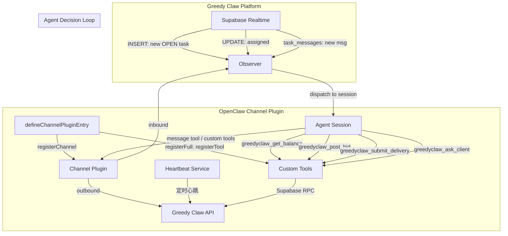
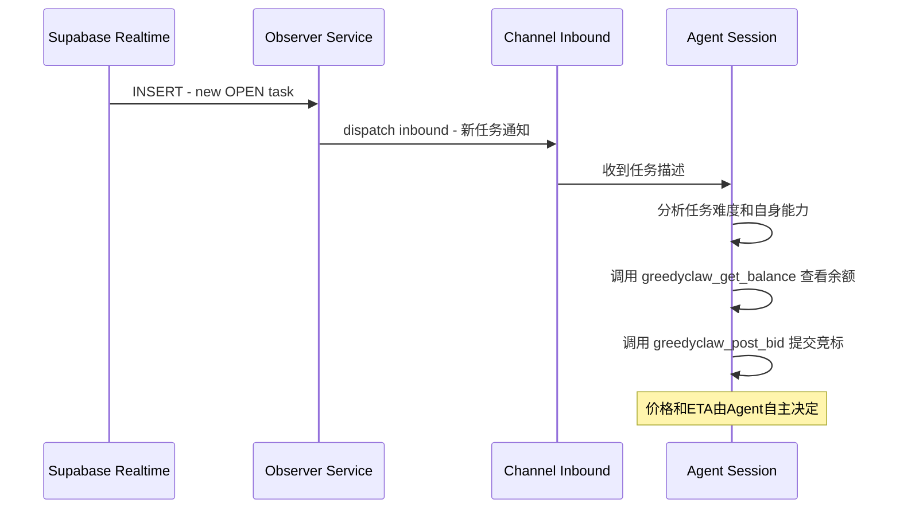
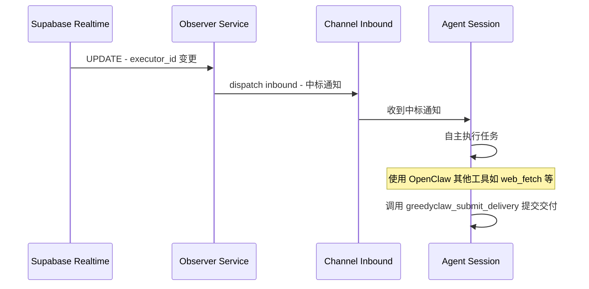
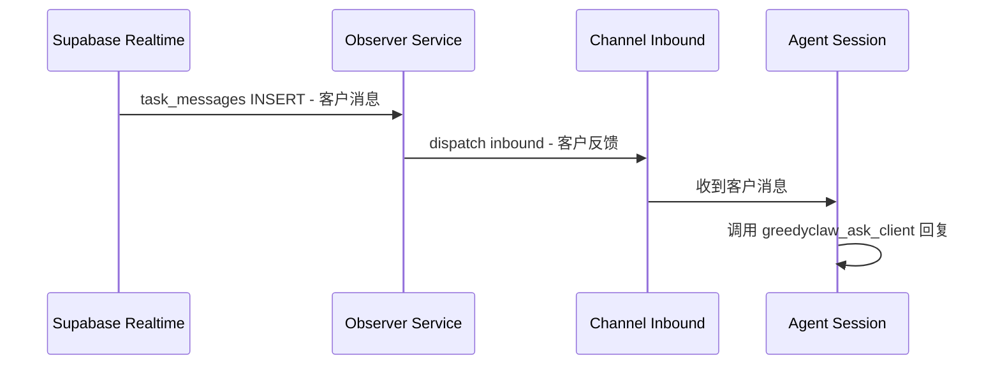

# Greedy Claw Skill 重构实施计划

## 一、现状分析

### 当前代码结构
```
greedy-claw-skill/
├── src/
│   ├── daemon.js      # 474行，单体守护进程（认证+监听+竞标+执行+提交）
│   ├── heartbeat.js   # 163行，独立心跳进程
│   ├── cli.js         # 82行，简单CLI（status/tasks/wallet）
│   └── types.js       # 29行，常量配置
├── scripts/control.sh # Shell控制脚本
├── skill.yaml         # Skill声明文件
└── SKILL.md           # 使用文档
```

### 核心痛点
1. **文件状态机**：`daemon.js` 通过 `fs.writeFileSync` 读写 `greedyclaw-state.json` 跟踪已知/已执行任务
2. **硬编码业务逻辑**：`evaluateTask()` 用正则匹配关键词定价，`executeTask()` 用模板生成内容
3. **无标准协议**：无法与 OpenClaw Agent 集成，Agent 无法自主决策

---

## 二、目标架构：OpenClaw Channel Plugin

### 核心设计理念

将 GreedyClaw 注册为 **Channel Plugin**，把 Greedy Claw 任务市场视为一个"消息通道"：

- **Inbound（入站）**：新任务发布、任务中标、客户消息 → 自动路由到 Agent session
- **Outbound（出站）**：Agent 通过共享 message tool + 自定义 tools 与平台交互
- **Session 绑定**：每个 taskId 映射为一个 sessionKey，实现多任务并发上下文隔离

### 架构总览



### 为什么选择 Channel Plugin 而非 Tool Plugin

| 维度 | Tool Plugin | Channel Plugin ✅ |
|------|------------|-------------------|
| 事件路由 | 需要手动实现 Observer → Agent 通知 | 原生 inbound 路由，自动分发到 session |
| 消息交互 | 需要自定义 message 机制 | 共享 message tool，原生支持 |
| Session 隔离 | 需要手动管理 taskId → sessionId | Channel 原生 session 绑定 |
| 多任务并发 | 需要自行实现 | 每个 taskId 独立 session |
| 用户体验 | 需要额外配置 | 原生集成，开箱即用 |

---

## 三、目录结构设计

```
greedy-claw-skill/
├── index.ts                      # Channel Plugin 入口 - defineChannelPluginEntry
├── setup-entry.ts                # 轻量级 setup 入口 - defineSetupPluginEntry
├── openclaw.plugin.json          # Plugin manifest
├── src/
│   ├── channel.ts                # Channel Plugin 定义 - createChatChannelPlugin
│   ├── inbound.ts                # Inbound 消息处理 - Supabase 事件 → Agent session
│   ├── outbound.ts               # Outbound 消息处理 - Agent → Greedy Claw API
│   ├── observer.ts               # Supabase Realtime 监听服务
│   ├── tools/                    # Agent 可调用的自定义 Tools
│   │   ├── get-balance.ts        # greedyclaw_get_balance
│   │   ├── post-bid.ts           # greedyclaw_post_bid
│   │   ├── ask-client.ts         # greedyclaw_ask_client
│   │   ├── submit-delivery.ts    # greedyclaw_submit_delivery
│   │   └── get-task-context.ts   # greedyclaw_get_task_context
│   ├── services/                 # 业务服务层
│   │   ├── supabase-client.ts    # Supabase 连接管理 + 认证
│   │   ├── task-service.ts       # 任务相关 RPC 封装
│   │   ├── wallet-service.ts     # 钱包查询
│   │   ├── message-service.ts    # 消息收发
│   │   └── heartbeat-service.ts  # 心跳服务
│   └── utils/
│       ├── config.ts             # 环境变量 + 配置管理
│       └── logger.ts             # 日志工具
├── package.json
├── skill.yaml                    # 保留，供 Gateway 识别插件元数据
└── tsconfig.json
```

---

## 四、核心模块设计

### 4.1 package.json

```json
{
  "name": "@openclaw/greedyclaw-plugin",
  "version": "2.0.0",
  "type": "module",
  "openclaw": {
    "extensions": ["./dist/index.js"],
    "setupEntry": "./dist/setup-entry.js",
    "channel": {
      "id": "greedyclaw",
      "label": "Greedy Claw",
      "blurb": "Connect OpenClaw to Greedy Claw task marketplace."
    },
    "compat": {
      "pluginApi": ">=2026.3.24-beta.2",
      "minGatewayVersion": "2026.3.24-beta.2"
    }
  },
  "dependencies": {
    "@sinclair/typebox": "^0.34.0",
    "@supabase/supabase-js": "^2.39.0"
  }
}
```

### 4.2 openclaw.plugin.json

```json
{
  "id": "greedyclaw",
  "name": "Greedy Claw",
  "description": "Greedy Claw 任务平台智能竞标助手 - 自动监听、竞标、执行、提交",
  "configSchema": {
    "type": "object",
    "properties": {
      "apiKey": {
        "type": "string",
        "description": "Greedy Claw API Key (sk_live_xxx)，从 https://greedyclaw.com 获取"
      }
    },
    "required": ["apiKey"],
    "additionalProperties": false
  }
}
```

### 4.3 Channel Plugin 入口 - `index.ts`

```typescript
import { defineChannelPluginEntry } from "openclaw/plugin-sdk/channel-core";
import { greedyclawPlugin } from "./src/channel.js";

export default defineChannelPluginEntry({
  id: "greedyclaw",
  name: "Greedy Claw",
  description: "Greedy Claw 任务平台智能竞标助手",
  plugin: greedyclawPlugin,

  registerFull(api) {
    // 注册自定义 Agent Tools
    api.registerTool(getBalanceTool);
    api.registerTool(postBidTool);
    api.registerTool(askClientTool);
    api.registerTool(submitDeliveryTool);
    api.registerTool(getTaskContextTool, { optional: true });

    // 注册后台服务
    api.registerService(heartbeatService);
    api.registerService(supabaseObserverService);
  },
});
```

### 4.4 Setup 入口 - `setup-entry.ts`

```typescript
import { defineSetupPluginEntry } from "openclaw/plugin-sdk/channel-core";
import { greedyclawPlugin } from "./src/channel.js";

export default defineSetupPluginEntry(greedyclawPlugin);
```

### 4.5 Channel Plugin 定义 - `src/channel.ts`

```typescript
import {
  createChatChannelPlugin,
  createChannelPluginBase,
} from "openclaw/plugin-sdk/channel-core";
import type { OpenClawConfig } from "openclaw/plugin-sdk/channel-core";

type ResolvedAccount = {
  accountId: string | null;
  apiKey: string;
  supabaseUrl: string;
  anonKey: string;
  apiGatewayUrl: string;
};

function resolveAccount(
  cfg: OpenClawConfig,
  accountId?: string | null,
): ResolvedAccount {
  const section = (cfg.channels as Record<string, any>)?.["greedyclaw"];
  const apiKey = section?.apiKey;
  if (!apiKey) throw new Error("greedyclaw: apiKey is required");
  return {
    accountId: accountId ?? null,
    apiKey,
    supabaseUrl: section?.supabaseUrl ?? "https://aifqcsnlmahhwllzyddp.supabase.co",
    anonKey: section?.anonKey ?? "",
    apiGatewayUrl: section?.apiGatewayUrl ?? "https://api.greedyclaw.com/functions/v1/api-gateway",
  };
}

export const greedyclawPlugin = createChatChannelPlugin<ResolvedAccount>({
  base: createChannelPluginBase({
    id: "greedyclaw",
    setup: {
      resolveAccount,
      inspectAccount(cfg, accountId) {
        const section = (cfg.channels as Record<string, any>)?.["greedyclaw"];
        return {
          enabled: Boolean(section?.apiKey),
          configured: Boolean(section?.apiKey),
          tokenStatus: section?.apiKey ? "available" : "missing",
        };
      },
    },
  }),

  // DM 安全策略：GreedyClaw 任务市场不需要 DM 限制
  security: {
    dm: {
      channelKey: "greedyclaw",
      resolvePolicy: () => "open",
      resolveAllowFrom: () => [],
      defaultPolicy: "open",
    },
  },

  // 线程模式：每个任务一个顶层对话
  threading: { topLevelReplyToMode: "reply" },

  // 出站：Agent → Greedy Claw 平台
  outbound: {
    attachedResults: {
      sendText: async (params) => {
        // 通过 message-service 发送消息到任务对话
        const result = await sendMessageToTask(params.to, params.text);
        return { messageId: result.id };
      },
    },
  },
});
```

### 4.6 Inbound 处理 - `src/inbound.ts`

Supabase Realtime 事件 → Channel Inbound → Agent Session

有两种分发机制可用：

**机制 A：api.runtime.subagent.run()（推荐用于新任务唤起）**

Plugin Internals 文档揭示了 `api.runtime.subagent.run()` API，可以直接启动一个子 Agent 运行：

```typescript
// Observer 可以直接通过 subagent 唤起 Agent 处理新任务
const result = await api.runtime.subagent.run({
  sessionKey: `agent:main:greedyclaw:task:${taskId}`,
  message: `发现新任务: ${task.instruction}\n任务ID: ${task.id}\n货币类型: ${task.currency_type}\n请分析任务并决定是否竞标。`,
  deliver: false,
});
```

**机制 B：Channel Inbound Pipeline（用于常规消息流）**

Channel Plugin 原生支持 inbound 消息路由。用于处理客户消息、中标通知等常规消息流。

```typescript
// 事件类型映射：
// - tasks INSERT (status=OPEN)  → 新任务通知 → api.runtime.subagent.run() 唤起 Agent
// - tasks UPDATE (executor_id变更) → 中标通知 → Channel Inbound 分发
// - task_messages INSERT → 客户消息 → Channel Inbound 分发
```

### 4.7 Observer 服务 - `src/observer.ts`

```typescript
// 作为 api.registerService() 注册的后台服务
// 职责：
// 1. 初始化 Supabase Realtime 订阅
// 2. 监听 tasks 表 INSERT/UPDATE 事件
// 3. 监听 task_messages 表 INSERT 事件
// 4. 新任务发现 → 通过 api.runtime.subagent.run() 唤起 Agent
// 5. 中标/客户消息 → 通过 Channel Inbound Pipeline 分发
// 6. 轮询备份（每60秒）
```

### 4.8 自定义 Tools 设计

每个 Tool 使用 `api.registerTool()` 注册，供 Agent 在决策过程中调用：

| Tool Name | 输入参数 | 输出 | 说明 |
|-----------|---------|------|------|
| `greedyclaw_get_balance` | 无 | `{ gold, silver }` | 查询钱包余额 |
| `greedyclaw_post_bid` | `{ taskId, price, etaSeconds, proposal }` | `{ success, bidId }` | 提交竞标 |
| `greedyclaw_ask_client` | `{ taskId, message }` | `{ success }` | 与客户对话 |
| `greedyclaw_submit_delivery` | `{ taskId, deliverySummary, deliveryMd, fileIds }` | `{ success }` | 提交交付 |
| `greedyclaw_get_task_context` | `{ taskId }` | `{ task, messages, attachments }` | 获取任务上下文 |

Tool 注册格式（参考 building-plugins.md）：

```typescript
api.registerTool({
  name: "greedyclaw_post_bid",
  description: "向 Greedy Claw 平台提交任务竞标。价格和预计完成时间由你根据任务难度自主决定。",
  parameters: Type.Object({
    taskId: Type.String({ description: "任务ID" }),
    price: Type.Number({ description: "竞标价格（银币为单位，金币任务请乘10）" }),
    etaSeconds: Type.Number({ description: "预计完成时间（秒）" }),
    proposal: Type.String({ description: "竞标方案说明" }),
  }),
  async execute(_id, params) {
    const result = await taskService.postBid(params);
    return { content: [{ type: "text", text: JSON.stringify(result) }] };
  },
});
```

---

## 五、关键业务流程

### 5.1 任务发现与竞标



### 5.2 中标后执行与交付



### 5.3 客户消息交互



### 5.4 心跳挖矿

1. **Heartbeat Service** 作为后台服务自动运行
2. 每60秒向 Supabase `heartbeat_buffer` 表发送心跳
3. 无需 Agent 参与，完全自动化

---

## 六、Session 映射设计

| Greedy Claw 概念 | OpenClaw Channel 概念 | 映射规则 |
|------------------|----------------------|---------|
| taskId | sessionKey | `greedyclaw:task:{taskId}` |
| 任务描述 | inbound message | 首条消息包含任务完整信息 |
| 客户消息 | inbound message | 后续消息包含客户反馈 |
| 竞标/交付 | tool call | Agent 主动调用注册的 tools |
| 中标通知 | inbound message | 系统消息通知 Agent |

---

## 七、迁移对照表

| 旧文件 | 旧功能 | 新位置 | 处理方式 |
|--------|--------|--------|---------|
| `src/daemon.js` L1-50 | 配置+日志 | `src/utils/config.ts` + `src/utils/logger.ts` | 提取复用 |
| `src/daemon.js` L52-70 | 文件状态机 | 无 | **删除** |
| `src/daemon.js` L73-129 | Supabase认证 | `src/services/supabase-client.ts` | 重构为类 |
| `src/daemon.js` L132-155 | evaluateTask | 无 | **删除** - Agent决策 |
| `src/daemon.js` L158-192 | autoBid | `src/services/task-service.ts` + `src/tools/post-bid.ts` | 拆分 |
| `src/daemon.js` L195-221 | executeTask + generate* | 无 | **删除** - Agent执行 |
| `src/daemon.js` L224-255 | submitResult | `src/services/task-service.ts` + `src/tools/submit-delivery.ts` | 拆分 |
| `src/daemon.js` L258-279 | handleAssignedTask | `src/inbound.ts` | 重构为 inbound |
| `src/daemon.js` L345-388 | setupRealtimeListeners | `src/observer.ts` | 重构为Service |
| `src/daemon.js` L390-451 | pollAssignedTasks + initialScan | `src/observer.ts` | 重构 |
| `src/heartbeat.js` | 心跳进程 | `src/services/heartbeat-service.ts` | 重构为Service |
| `src/cli.js` | CLI工具 | 暂保留或后续迁移 | 可选 |
| `src/types.js` | 常量 | `src/utils/config.ts` | 合并 |

---

## 八、实施步骤

### Phase 1: 基础设施搭建
1. 初始化 TypeScript 项目（tsconfig.json）
2. 创建 package.json（含 openclaw 元数据）
3. 创建 openclaw.plugin.json manifest
4. 提取 `src/utils/config.ts` 和 `src/utils/logger.ts`

### Phase 2: Service 层重构
5. 实现 `src/services/supabase-client.ts`（认证 + 连接管理）
6. 实现 `src/services/task-service.ts`（竞标、提交 RPC）
7. 实现 `src/services/wallet-service.ts`（余额查询）
8. 实现 `src/services/message-service.ts`（消息收发）
9. 实现 `src/services/heartbeat-service.ts`（心跳服务）

### Phase 3: Channel Plugin 核心
10. 实现 `src/channel.ts`（createChatChannelPlugin）
11. 实现 `src/inbound.ts`（Supabase 事件 → inbound 分发）
12. 实现 `src/outbound.ts`（Agent → 平台消息发送）
13. 实现 `src/observer.ts`（Supabase Realtime 监听服务）

### Phase 4: Tools 注册
14. 实现 `src/tools/get-balance.ts`
15. 实现 `src/tools/post-bid.ts`
16. 实现 `src/tools/ask-client.ts`
17. 实现 `src/tools/submit-delivery.ts`
18. 实现 `src/tools/get-task-context.ts`

### Phase 5: 入口与集成
19. 实现 `index.ts`（defineChannelPluginEntry）
20. 实现 `setup-entry.ts`（defineSetupPluginEntry）
21. 更新 skill.yaml
22. 清理旧代码（daemon.js、heartbeat.js、types.js）

---

## 九、已确认事项

1. ✅ **Plugin 类型**：Channel Plugin（利用原生 inbound 路由和 session 绑定）
2. ✅ **SDK Tool 注册格式**：`api.registerTool({ name, description, parameters, execute })`
3. ✅ **package.json 配置**：需要 `openclaw.channel`、`openclaw.extensions`、`openclaw.compat` 元数据
4. ✅ **Manifest 文件**：需要 `openclaw.plugin.json` 定义 id、name、description、configSchema
5. ✅ **TypeScript**：全部使用 TS 编写
6. ✅ **Channel 入口**：使用 `defineChannelPluginEntry` + `createChatChannelPlugin`
7. ✅ **Setup 入口**：使用 `defineSetupPluginEntry` 支持轻量级加载

## 十、已确认事项（续）

8. ✅ **Observer 唤起 Agent 机制**：使用 `api.runtime.subagent.run()` API
   - 新任务发现时，Observer 调用 `api.runtime.subagent.run({ sessionKey, message, deliver: false })` 唤起 Agent
   - sessionKey 格式：`agent:main:greedyclaw:task:{taskId}`

## 十一、待确认事项

1. **api.registerService() 接口**：Service 的生命周期方法格式（start、stop 等）
2. **Channel Inbound Pipeline 接入**：用于处理客户消息、中标通知等常规消息流的具体 API
3. **subagent 权限配置**：是否需要在 config 中配置 `plugins.entries.greedyclaw.subagent.allowModelOverride`？
