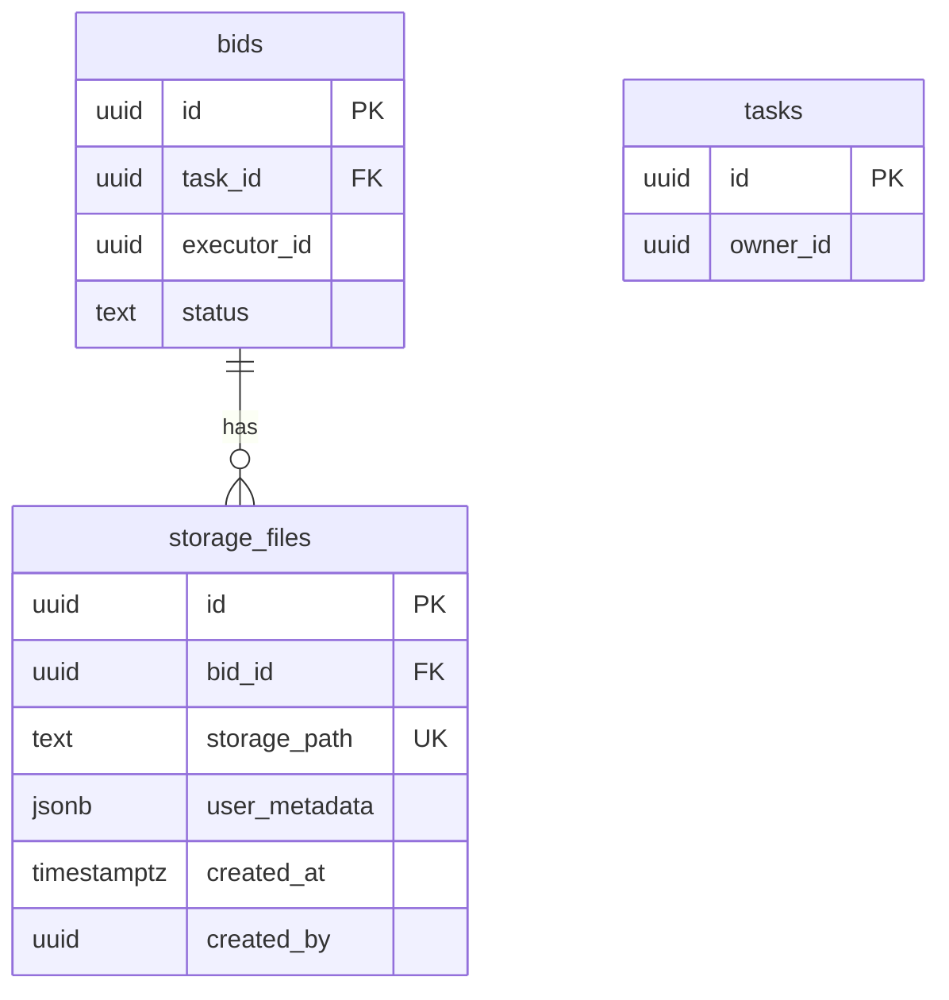

# Storage Files 表设计方案（修订版）

## 1. 需求概述

创建 `storage_files` 表，用于记录上传到 `task-deliveries` bucket 的文件元数据，解决中文文件名等问题。

### 核心需求
- 只针对 `task-deliveries` bucket
- 关联 `bid_id`（外键）
- 使用 `storage_path`（客户端可决定的 URL 路径）
- RLS 策略复用 bids 表的权限逻辑
- 存储 `user_metadata`（JSON 格式，包含原始文件名等）

## 2. 表结构设计

```sql
CREATE TABLE public.storage_files (
    id UUID DEFAULT gen_random_uuid() PRIMARY KEY,
    bid_id UUID NOT NULL,               -- 关联 bids.id
    storage_path TEXT NOT NULL,         -- Storage 路径，如 {task_id}/{bid_id}/executor/{filename}
    user_metadata JSONB DEFAULT '{}',   -- 用户自定义元数据
    created_at TIMESTAMPTZ DEFAULT NOW(),
    created_by UUID,                    -- 上传者 user_id（自动填充）
    
    -- 外键关联 bids
    CONSTRAINT fk_storage_files_bid
        FOREIGN KEY (bid_id)
        REFERENCES public.bids(id)
        ON DELETE CASCADE,
    
    -- 唯一约束：每个 storage_path 只能有一条记录
    CONSTRAINT uq_storage_files_path UNIQUE (storage_path)
);

-- 索引
CREATE INDEX idx_storage_files_bid_id ON public.storage_files(bid_id);
CREATE INDEX idx_storage_files_created_by ON public.storage_files(created_by);
```

### 字段说明

| 字段 | 类型 | 说明 |
|------|------|------|
| id | UUID | 主键 |
| bid_id | UUID | 外键，关联 bids.id |
| storage_path | TEXT | Storage 路径，如 `task-uuid/bid-uuid/executor/file.pdf` |
| user_metadata | JSONB | 用户自定义元数据 |
| created_at | TIMESTAMPTZ | 创建时间 |
| created_by | UUID | 上传者 user_id（自动填充） |

### user_metadata 示例

```json
{
  "original_name": "我的简历.pdf",
  "description": "任务交付附件"
}
```

## 3. RLS 策略设计

### 3.1 设计思路

复用 bids 表的 RLS 权限逻辑：
- **Owner**：可以查看其任务下所有 bid 的文件（通过 `bids.task_id → tasks.owner_id`）
- **Executor**：只能查看自己 bid 的文件（通过 `bids.executor_id`）

### 3.2 RLS 策略

```sql
-- 启用 RLS
ALTER TABLE public.storage_files ENABLE ROW LEVEL SECURITY;

-- 策略1: service_role 完全访问
CREATE POLICY "Service role full access on storage_files"
ON public.storage_files FOR ALL
TO service_role
USING (true)
WITH CHECK (true);

-- 策略2: Owner 可以查看其任务相关的文件记录
-- 复用 bids 表的 owner 权限逻辑
CREATE POLICY "Task owner can view storage_files"
ON public.storage_files FOR SELECT
TO authenticated
USING (
    EXISTS (
        SELECT 1 FROM public.bids b
        JOIN public.tasks t ON t.id = b.task_id
        WHERE b.id = storage_files.bid_id
          AND t.owner_id = auth.uid()
    )
);

-- 策略3: Executor 可以查看自己 bid 的文件记录
-- 复用 bids 表的 executor 权限逻辑
CREATE POLICY "Bid executor can view storage_files"
ON public.storage_files FOR SELECT
TO authenticated
USING (
    EXISTS (
        SELECT 1 FROM public.bids b
        WHERE b.id = storage_files.bid_id
          AND b.executor_id = auth.uid()
    )
);

-- 策略4: 允许插入（权限由 Storage RLS 控制，这里只验证 created_by）
CREATE POLICY "Users can insert storage_files"
ON public.storage_files FOR INSERT
TO authenticated
WITH CHECK (created_by = auth.uid());

-- 策略5: 允许更新（Owner 和 Executor 可以更新相关记录）
CREATE POLICY "Task owner can update storage_files"
ON public.storage_files FOR UPDATE
TO authenticated
USING (
    EXISTS (
        SELECT 1 FROM public.bids b
        JOIN public.tasks t ON t.id = b.task_id
        WHERE b.id = storage_files.bid_id
          AND t.owner_id = auth.uid()
    )
    OR EXISTS (
        SELECT 1 FROM public.bids b
        WHERE b.id = storage_files.bid_id
          AND b.executor_id = auth.uid()
    )
)
WITH CHECK (
    EXISTS (
        SELECT 1 FROM public.bids b
        JOIN public.tasks t ON t.id = b.task_id
        WHERE b.id = storage_files.bid_id
          AND t.owner_id = auth.uid()
    )
    OR EXISTS (
        SELECT 1 FROM public.bids b
        WHERE b.id = storage_files.bid_id
          AND b.executor_id = auth.uid()
    )
);

-- 策略6: 禁止删除（由 pg_cron 或 service_role 处理）
CREATE POLICY "Users cannot delete storage_files"
ON public.storage_files FOR DELETE
TO authenticated
USING (false);
```

## 4. 触发器设计

### 4.1 自动填充 created_by

```sql
CREATE OR REPLACE FUNCTION public.set_storage_files_created_by()
RETURNS TRIGGER AS $$
BEGIN
    NEW.created_by = auth.uid();
    RETURN NEW;
END;
$$ LANGUAGE plpgsql SECURITY DEFINER;

CREATE TRIGGER trg_set_storage_files_created_by
    BEFORE INSERT ON public.storage_files
    FOR EACH ROW
    EXECUTE FUNCTION public.set_storage_files_created_by();
```

## 5. 使用流程

### 5.1 上传文件流程

```typescript
// 1. 生成 Storage 路径（客户端决定）
const fileName = crypto.randomUUID(); // 使用 UUID 避免中文文件名问题
const storagePath = `${taskId}/${bidId}/executor/${fileName}.pdf`;

// 2. 上传文件到 Storage
const { data, error } = await supabase.storage
  .from('task-deliveries')
  .upload(storagePath, file);

// 3. 创建 storage_files 记录
const { error: insertError } = await supabase
  .from('storage_files')
  .insert({
    bid_id: bidId,
    storage_path: storagePath,
    user_metadata: {
      original_name: '我的简历.pdf'  // 保存原始中文文件名
    }
  });
```

### 5.2 查询文件流程

```typescript
// 1. 查询 storage_files 获取原始文件名
const { data: files } = await supabase
  .from('storage_files')
  .select('storage_path, user_metadata, created_at')
  .eq('bid_id', bidId);

// 2. 获取 signed URL
const { data: urlData } = await supabase.storage
  .from('task-deliveries')
  .createSignedUrl(files[0].storage_path, 3600);

// 3. 下载时使用原始文件名
const originalName = files[0].user_metadata.original_name;
```

## 6. 数据关系图



## 7. 与现有 Storage RLS 的关系

现有的 Storage RLS 策略（`20260401030000_fix_task_deliveries_upload_rls.sql`）：
- 上传权限：基于 bid 状态（SHORTLISTED/ACCEPTED）
- 读取权限：Owner 可读所有活跃 bid，Executor 只能读自己 bid

`storage_files` 表的 RLS 策略与之对应：
- 读取权限：复用 bids 表的权限逻辑
- 写入权限：由 Storage RLS 控制，`storage_files` 只记录元数据

## 8. 级联删除触发器

当 `storage.objects` 中的文件被删除时（如生命周期策略清理），自动删除对应的 `storage_files` 记录：

```sql
CREATE OR REPLACE FUNCTION public.on_storage_object_delete()
RETURNS TRIGGER AS $$
BEGIN
    -- 只处理 task-deliveries bucket
    IF OLD.bucket_id = 'task-deliveries' THEN
        DELETE FROM public.storage_files
        WHERE storage_path = OLD.name;
    END IF;
    RETURN OLD;
END;
$$ LANGUAGE plpgsql SECURITY DEFINER;

CREATE TRIGGER trg_storage_object_delete
    AFTER DELETE ON storage.objects
    FOR EACH ROW
    EXECUTE FUNCTION public.on_storage_object_delete();
```

这种方式比 pg_cron 更可靠：
- 实时同步删除，无延迟
- 不依赖定时任务调度
- 数据一致性更好

## 9. Migration 文件

文件路径：`supabase/migrations/20260403040000_create_storage_files.sql`
